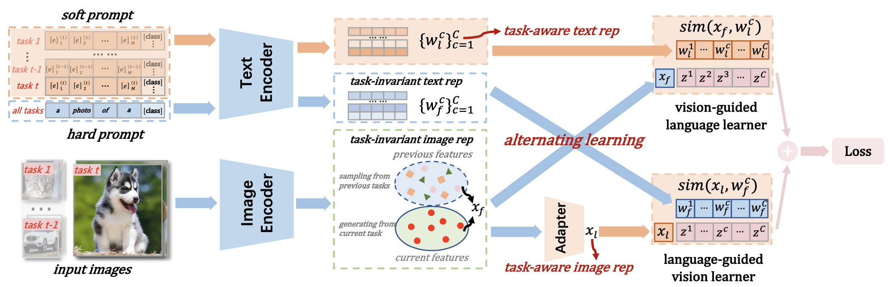

# Cross-Modal Alternating Learning with Task-Aware Representations for Continual Learning
This is the *Pytorch Implementation* for the paper Cross-Modal Alternating Learning with Task-Aware Representations for Continual Learning

**Authors**: [Wujin Li](https://scholar.google.com/citations?user=QONFCAkAAAAJ&hl=zh-CN&oi=sra), [Bin-Bin Gao](https://scholar.google.com/citations?user=yYviZ-oAAAAJ&hl=zh-CN&oi=sra), [Bizhong Xia](), [Jinbao Wang](https://scholar.google.com/citations?hl=zh-CN&user=qI80ipUAAAAJ&view_op=list_works&sortby=pubdate), [Yong Liu](https://scholar.google.com/citations?user=aqvFa1EAAAAJ&hl=zh-CN&oi=sra), [Chengjie Wang](https://scholar.google.com/citations?user=fqte5H4AAAAJ&hl=zh-CN), [Feng Zheng](https://scholar.google.com/citations?hl=zh-CN&user=PcmyXHMAAAAJ&view_op=list_works&sortby=pubdate)

## Abstract


Continual learning is a research field of artificial neural networks to simulate human lifelong learning ability. Although a surge of investigations has achieved considerable performance, most rely only on image modality for incremental image recognition tasks. In this paper, we propose a novel yet effective framework coined cross-modal Alternating Learning with Task-Aware representations (ALTA) to make good use of visual and linguistic modal information and achieve more effective continual learning. To do so, ALTA presents a cross-modal joint learning mechanism, which utilizes task-invariant image representation while replaying task-aware cross-modal representations to provide more effective supervision. Concurrently, considering the dilemma of stability and plasticity, ALTA proposes a cross-modal alternating learning strategy that alternately learns the task-aware cross-modal representations to match the image-text pairs between tasks better, further enhancing the ability of continual learning. We conduct extensive experiments under various popular image classification benchmarks to demonstrate that our approach achieves state-of-the-art performance. At the same time, systematic ablation studies and visualization analyses validate the effectiveness and rationality of our method.

__Contribution of this work__
- We propose a novel yet effective continual learning framework, cross-modal Alternating Learning with Task-Aware representations for continual learning (ALTA), which makes rational use of visual and linguistic modal information to achieve more effective continual learning. To the best of our knowledge, we are the first to introduce the idea of cross-modal representation in the field of continual learning.
- ALTA includes a cross-modal joint learning mechanism to simultaneously learn image and text representation to alleviate catastrophic forgetting, which closely models the dual coding theory. Furthermore, ALTA presents a cross-modal alternating learning strategy to avoid damaging the previously well-learned visual-linguistic representation space during sequential training, and to better balance stability and plasticity.
- Experimental results show that our method achieves state-of-the-art performance in both the class-IL and task-IL settings. And carefully designed ablation studies and analyses reveal the inherent problems of the unimodal rehearsal method, and further prove the effectiveness and rationality of our method.

## Prerequisites
```
$ pip install -r requirements.txt
```
Before running the program, change `--cifar10_dir`, `--cifar100_dir`, and `--tinyimagenet_dir` in `arguments.py` to your file path.

## Run
```
$ python main.py --config-file configs/xxx.yaml --method xxx --il_setting xxx --visual xxx --buffer_size xxx --seed xxx
```
`--config-file`: il_cifar10.yaml, sgd_cifar10.yaml, joint_cifar10.yaml, il_cifar100.yaml, sgd_cifar100.yaml, joint_cifar100.yaml, il_tiny.yaml, sgd_tiny.yaml, joint_tiny.yaml.

`--method`: mlp, resmlp, sprompt, cprompt, cprompt_oriprompt, cprompt_mlp, cprompt_resmlp, oriclip2cprompt_mlp, oritext_mlp2cprompt_oriimg.

`--il_setting`: class-il, task-il.

`--visual`: RN50, RN101, RN50x4, RN50x16, ViT-B/32, ViT-B/16.


## Contributing
We'd love to accept your contributions to this project. Please feel free to open an issue, or submit a pull request as necessary. If you have implementations of this repository in other ML frameworks, please reach out so we may highlight them here.

## Acknowledgment
The code is build upon [KaiyangZhou/CoOp](https://github.com/KaiyangZhou/CoOp) and [aimagelab/mammoth](https://github.com/aimagelab/mammoth).

## Citation
If you found the provided code useful, please cite our work.


